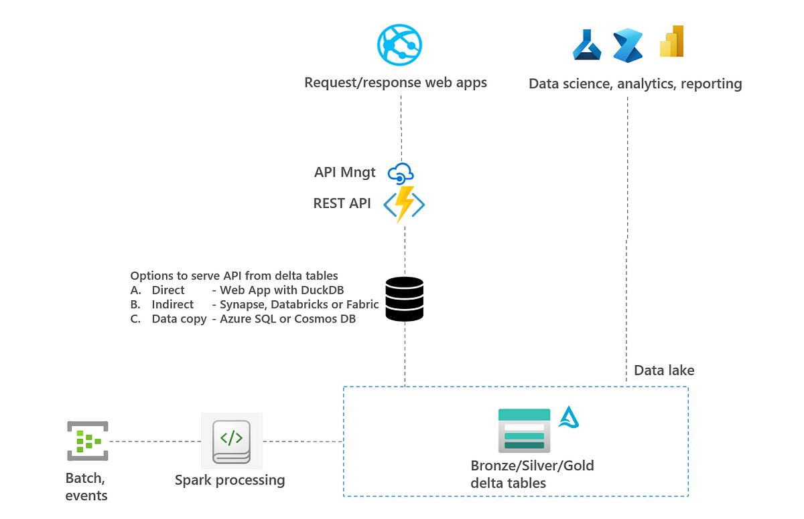
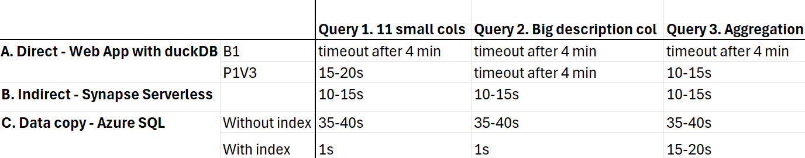

# serve-api-from-deltatable

Git repo to test 3 architectures to serve an api from delta table:

- Architecture A: Direct, Web App with DuckDB. In this architecture, APIs are directly connecting to the delta table and there is no layer in between. This implies that all data is analyzed in app service plan of the Azure Function. 
- Architecture B: Indirect, Synapse, Databricks or Fabric layer. In this architecture, APIs are connecting to layer that fetches and analyses date from delta table. Data is not duplicated to layer in between
- Architecture C: Data Copy, Azure SQL or Cosmos DB. In this architecture, APIs are connecting to a different storage layer to which the data is duplicated and optimized for querying.

See also overview below:



Steps to take:

1. Create storage account and convert [sample csv data](https://azuresynapsestorage.blob.core.windows.net/sampledata/WideWorldImportersDW/csv/full/WideWorldImportersDW/csv/full/fact_sale_1y_full/) to delta. See [sample script](Solution_scripts/csv_to_delta.py) how to do this, csv data can be viewed in storage explorer (not in web browser)
2. Create a service principal and give that service principal access to the storage account where delta lake data is stored.
3. Deploy Azure Function in ```ServeApiDeltaExample```. See also [here](https://learn.microsoft.com/en-us/azure/azure-functions/create-first-function-vs-code-python) to deploy Azure Functions. Alternate between B1 and P1v3 SKU to run tests.
4. For architecture A: No additional resources requirement, dependencies are captured in [requirement](requirements.txt)
5. For architecture B: Synapse workspace is required with a serverless database. SPN needs to have datareader access in Synapse and data needs to be created as an external table in Synapse. Run scripts in [scripts](Solution_scripts/Solution_B_sqlscript.sql) to create tables
6. For architecture C: Azure SQL is required. DTU is 125 is used in the tests. Run scripts in [scripts](Solution_scripts/Solution_C_sqlscript) to create tables

Test can then be run be triggering Azure Functions, see [links](Solution_scripts/links.txt).

